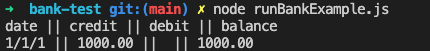

# Bank Tech Test

## Quick start

1. Clone this repo
2. Install dependencies with: "npm install"
3. Run tests with: "jest"
4. Run the Node REP: "node"
5. Require in Bank with: "const Bank = require('./bank/bank.js')"
6. Set up your own bank with: "let bank = new Bank();"
7. Require Deposit with: "const Deposit = require('./deposit/deposit.js');"
8. Set up your own deposit with: "deposit = new Deposit('1/1/1', 1000);"
9. Insert your deposit with: "bank.insert(deposit)"
10. Get your bank statement with: "bank.getStatement()"
11. You should get returned: 'date || credit || debit || balance\n1/1/1 || 1000.00 || || 1000.00'

12. OR type: "node runBankExample.js" to see an example of the output

## Requirements

You should be able to interact with your code via a REPL like IRB or Node. (You don't need to implement a command line interface that takes input from STDIN.)
Deposits, withdrawal.
Account statement (date, amount, balance) printing.
Data can be kept in memory (it doesn't need to be stored to a database or anything).

## Acceptance Criteria

Given a client makes a deposit of 1000 on 10-01-2023
And a deposit of 2000 on 13-01-2023
And a withdrawal of 500 on 14-01-2023
When she prints her bank statement
Then she would see

date || credit || debit || balance
14/01/2023 || || 500.00 || 2500.00
13/01/2023 || 2000.00 || || 3000.00
10/01/2023 || 1000.00 || || 1000.00

## User story

1. As a user i want to add a deposit
2. As a user i want to print my bank statement
3. As a user i want to see what date i added the deposit
4. As a user i want to see how much credit i have
5. As a user i want to see how much debit i have
6. As a user i want to see what my balance is
7. As a user i want to withdraw money

## Process

To start with after diseccting a user story from the acceptance critera and requirements i diagrammed my 3 classes. Deciding what methods and information they would contain. I started by writing 3 spec files and making sure each class returned the correct object. This ensured the test files were synced and everything was working.

I then tested both the withdrawal and deposit classes to ensure they did everything they needed to do using TDD.

I then tested all the integration cases to create the final work. Once i had done this and ensured the app worked in the way i wanted it to i wrote the tests using mocks to ensure i would be able to troubleshoot any issues.

## Reflections

In hindsight i could have probably used two classes, a Bank class and a Transaction class instead of splitting it into 3. Bank, Deposit, Withdrawal. Although this may be more user friendly especially as it scales.

I probably should have wrote the mock Bank tests and TDD with those rather than using the integration tests to TDD with.

I didn't commit nearly as much as i should have from the start and only once i'd realised did i start to regularly commit.

All in all i am happy with the final product, I think the classes and methods are easy to understand and follow. I probably should have made the tests easier to digest, and not done a BeforeEach for all of them.
